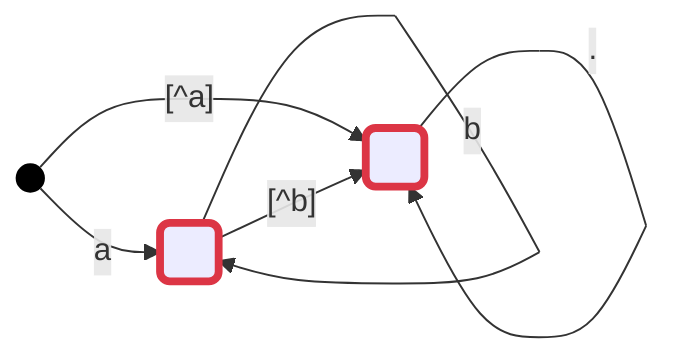

```mermaid
graph LR
    2( )
    0(( ))
    1( )
    style 2 stroke:#dc3545,stroke-width:4px
    style 0 fill:#000,stroke-width:0px
    style 1 stroke:#dc3545,stroke-width:4px
    2 -- "." --> 2
    0 -- "a" --> 1
    0 -- "[^a]" --> 2
    1 -- "b" --> 1
    1 -- "[^b]" --> 2
```