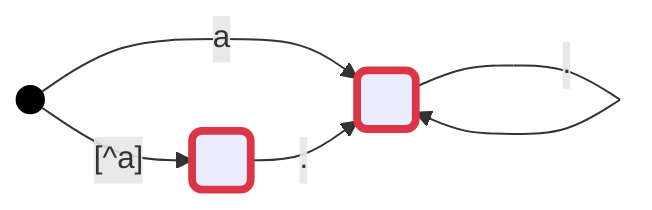

```mermaid
graph LR
    0(( ))
    1( )
    2( )
    style 0 fill:#000,stroke-width:0px
    style 1 stroke:#dc3545,stroke-width:4px
    style 2 stroke:#dc3545,stroke-width:4px
    0 -- "[^a]" --> 1
    0 -- "a" --> 2
    1 -- "." --> 2
    2 -- "." --> 2
```
